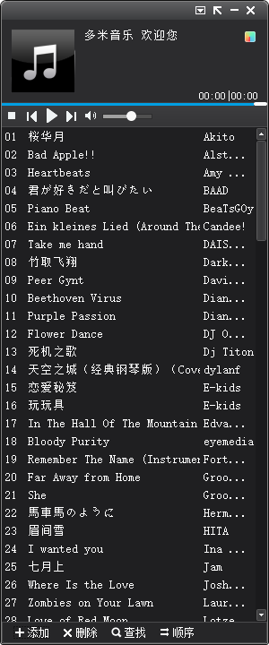
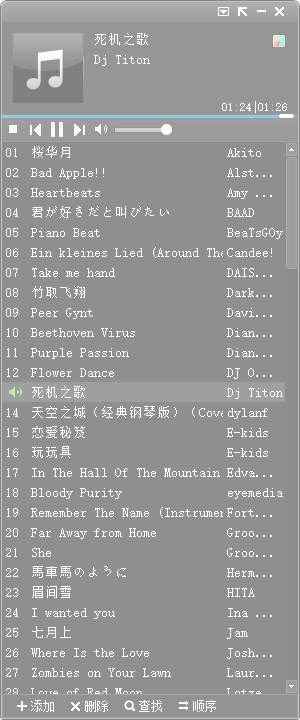
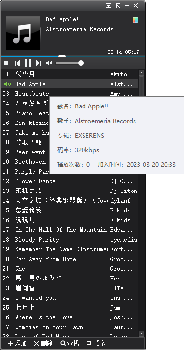
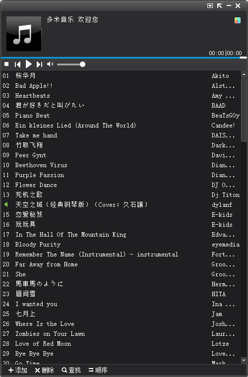

MusicPlayer
--------

本软件使用WPF技术，模仿多米音乐制作而成

仅供技术学习使用，不可用于商业用途

功能
--------

- 播放功能
  1. 播放控制
     1. 停止
     2. 上一首
     3. 暂停/播放
     4. 下一首
     5. 播放进度调整
     6. 列表双击播放
  2. 音量控制
     1. 静音
     2. 音量调节
  3. 歌曲详情
  4. 添加
     1. 添加本地歌曲文件
     2. 添加本地歌曲目录
  5. 删除
     1. 删除所选歌曲
     2. 删除重复歌曲
     3. 删除错误歌曲
     4. 清空列表
     5. 高级删除
        1. 按添加时间
           1. 删除一天前添加的
           2. 删除一周前添加的
           3. 删除一个月前添加的
        2. 按播放次数
           1. 删除未播放过的
           2. 删除播放过3次以下的
           3. 删除播放过6次以下的
  6. 顺序
     1. 顺序播放
     2. 循环播放
     3. 随机播放
     4. 单曲循环
     5. 排序
        1. 按歌名排序
        2. 按歌手排序
        3. 按播放次数排序
        4. 按添加时间
- 其他功能
  1. 靠边隐藏
  2. 透明度设置
  3. 窗体大小调整
  4. 按钮移入、移出、点击效果

图片
--------

